<div align="center">

# 📍 Field Survey Pro

### Smart Field Survey & Inspection App

A React Native + Expo mobile application for capturing structured field-survey data — including site information, photos, contacts and GPS coordinates — in one streamlined workflow.

**React Native · Expo SDK 54 · Mobile Field Survey**

[](https://www.youtube.com/watch?v=z-bB75HuBuc)

</div>

---

## 📌 Problem Statement

Field surveys often require collecting several kinds of information at the same time: site details, client information, photos, contact details, geographic coordinates and notes. When this information is captured using separate apps or manual processes, the workflow becomes slow, fragmented and harder to organise.

A field worker needs a simple mobile-first solution that keeps the essential survey tools together and makes it easy to review collected information before submission.

## 💡 Solution

**Field Survey Pro** provides a unified mobile workflow for creating and managing field surveys. Users can enter survey details, capture a site photo, select a device contact, record the current GPS location, review everything on a survey preview screen and then submit the survey.

The app also provides dedicated utilities for the camera, contacts, location and clipboard, along with survey history, profile information, navigation and theme settings.

## ✨ Features

- 📝 **Create Surveys** — Enter site name, client name, description, priority and date.
- 📷 **Camera Capture** — Capture a site photo, preview it, retake it, delete it or attach it to a survey.
- 👥 **Contact Selection** — Search device contacts and quickly copy or attach contact information.
- 📍 **GPS Location** — Capture latitude, longitude and accuracy, refresh the reading, copy it or save it to the survey.
- 📋 **Clipboard Manager** — Quickly copy survey ID, contact number and location, paste notes and clear clipboard data.
- 👀 **Survey Preview** — Review survey details, photo, contact and location before submission.
- ✅ **Survey Submission Flow** — Edit a survey from preview or submit the completed record.
- 🕘 **Survey History** — Search previous surveys and filter by High, Medium or Low priority.
- 📊 **Dashboard** — View survey statistics, quick actions and recent surveys.
- 👤 **Profile** — Student profile and shortcuts to major app features.
- 🎨 **Theme Settings** — System Default, Light Mode and Dark Mode options.
- 🧭 **Navigation** — Bottom-tab navigation plus a side drawer for quick access.

## 🛠️ Tech Stack

| Technology | Version | Purpose |
| --- | --- | --- |
| **React Native** | 0.81.5 | Cross-platform mobile application |
| **React** | 19.1.0 | Component-based UI |
| **Expo** | SDK 54 | Development platform and native APIs |
| **TypeScript** | ~5.9.2 | Typed development |
| **Expo Router** | ~6.0.24 | File-based routing |
| **React Navigation Drawer** | ^7.5.0 | Side drawer navigation |
| **Expo Camera** | ~17.0.10 | Site-photo capture |
| **Expo Contacts** | ~15.0.11 | Device contact access |
| **Expo Location** | ~19.0.8 | GPS coordinates and accuracy |
| **Expo Clipboard** | ~8.0.8 | Clipboard utilities |
| **DateTimePicker** | 8.4.4 | Survey date selection |
| **Expo Vector Icons** | ^15.0.3 | Application icons |
| **Reanimated + Gesture Handler** | ~4.1.1 / ~2.28.0 | Gestures and animations |

Additional packages include `expo-font`, `expo-linking`, `expo-constants`, `expo-status-bar`, `react-native-safe-area-context`, `react-native-screens`, `react-native-web` and `react-native-worklets`.

## 📂 Project Structure

```text
Field_Survey_Pro/
├── .claude/
├── .expo/
├── app/
│   ├── (tabs)/
│   │   ├── _layout.tsx
│   │   ├── history.tsx
│   │   ├── index.tsx
│   │   ├── new-survey.tsx
│   │   └── profile.tsx
│   ├── survey-details/
│   │   └── [id].tsx
│   ├── _layout.tsx
│   ├── camera.tsx
│   ├── clipboard.tsx
│   ├── contacts.tsx
│   ├── location.tsx
│   ├── settings.tsx
│   └── survey-preview.tsx
├── assets/
├── components/
│   ├── AppHeader.tsx
│   ├── QuickActionCards.tsx
│   └── RecentSurveySummary.tsx
├── constants/
│   └── Colors.js
├── context/
│   ├── SurveyContext.js
│   └── ThemeContext.js
├── dist/
├── node_modules/
├── screenshots/
├── .gitignore
├── AGENTS.md
├── app.json
├── CLAUDE.md
├── index.js
├── LICENSE
├── metro.config.js
├── package-lock.json
├── package.json
├── README.md
└── tsconfig.json
```

### Architecture

`app/` contains the Expo Router screens. The `(tabs)` route group powers **Dashboard**, **New Survey**, **History** and **Profile**. Utility screens such as **Camera**, **Contacts**, **Location**, **Clipboard**, **Settings** and **Survey Preview** live at the app level, while `survey-details/[id].tsx` provides a dynamic route for individual surveys.

`components/` contains reusable UI, `context/` manages shared survey and theme state, `constants/Colors.js` centralises colours, and `screenshots/` contains the images displayed below.

## 📱 Screenshots

### Dashboard · New Survey · Survey Preview

<p align="center">
  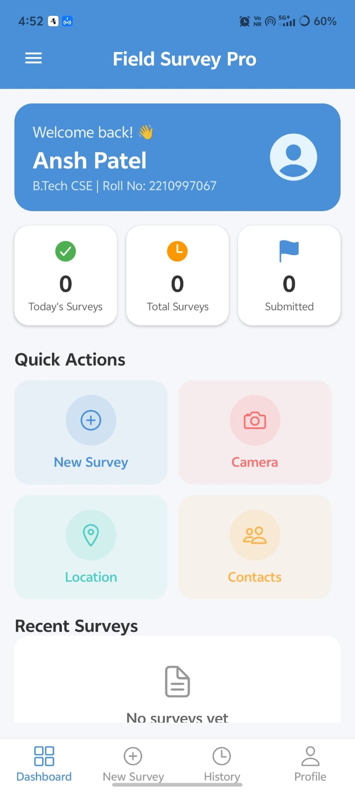
  &nbsp;
  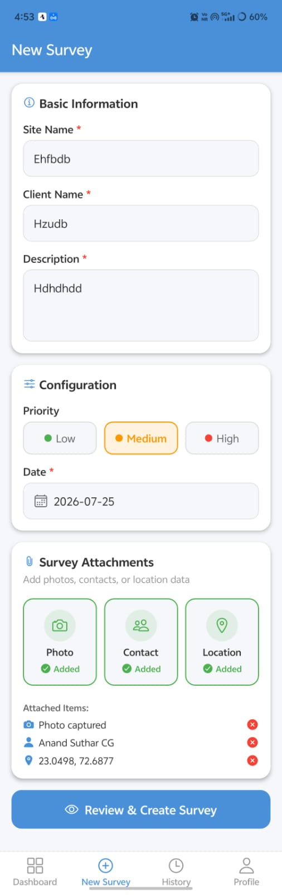
  &nbsp;
  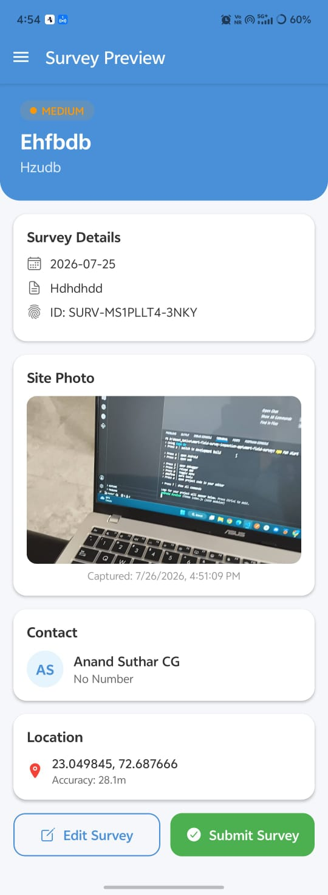
</p>

### Camera · Contacts · Location

<p align="center">
  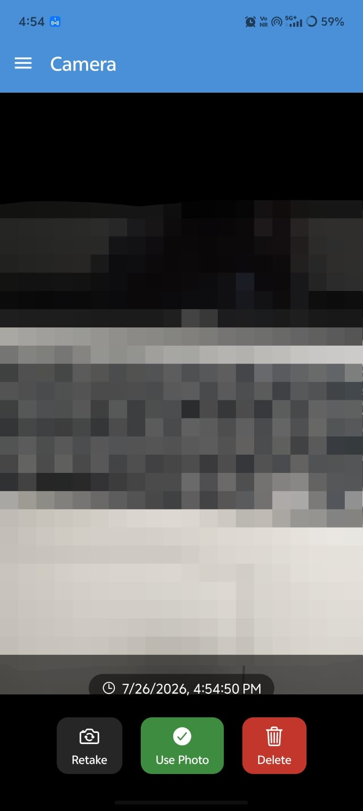
  &nbsp;
  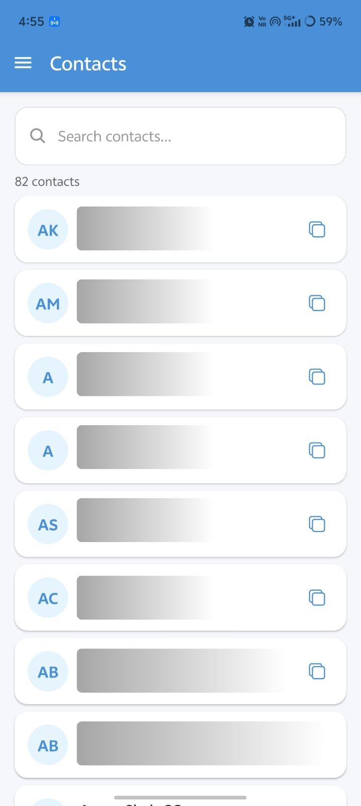
  &nbsp;
  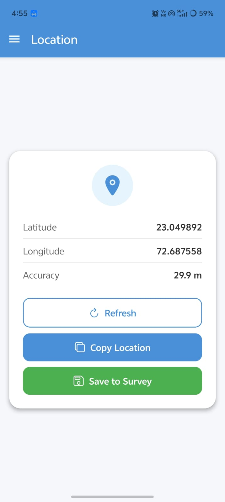
</p>

### Clipboard · History · Profile

<p align="center">
  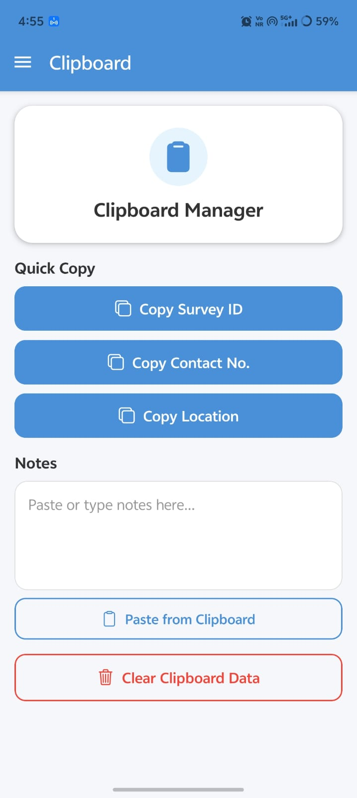
  &nbsp;
  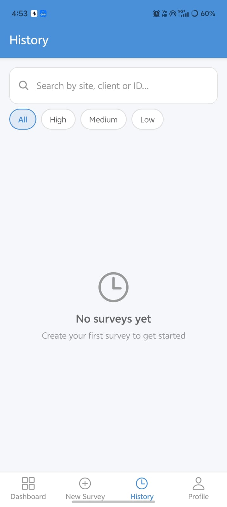
  &nbsp;
  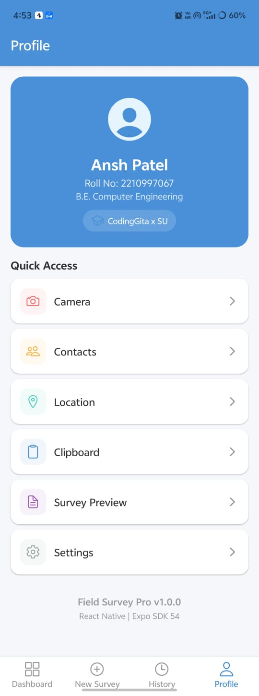
</p>

### Drawer Navigation · Settings

<p align="center">
  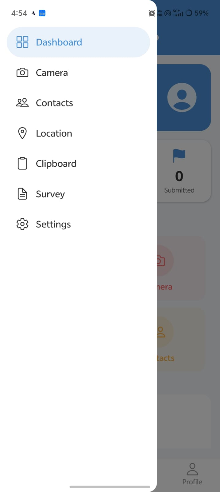
  &nbsp;
  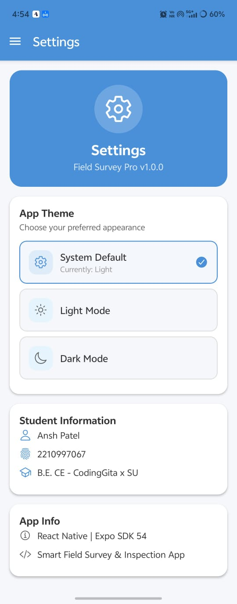
</p>

## 🚀 Getting Started

### Prerequisites

Install **Node.js**, **npm** and the **Expo Go** app on a physical device, or configure an Android/iOS emulator.

### Installation

```bash
git clone YOUR_GITHUB_REPO_URL
cd Field_Survey_Pro

npm install
npx expo start
```

Scan the QR code with Expo Go, or launch the project on a configured emulator.

## 🔐 Device Permissions

The application uses device features such as the **camera**, **contacts** and **location**. Grant the requested permissions when prompted so that survey attachments work correctly.

## 🔄 Typical Survey Workflow

```text
Dashboard
   ↓
New Survey
   ↓
Enter Basic Information + Priority + Date
   ↓
Attach Photo + Contact + GPS Location
   ↓
Review & Create Survey
   ↓
Survey Preview
   ↓
Edit or Submit
   ↓
History / Dashboard
```

## 🖥️ Main Screens

| Screen | Purpose |
| --- | --- |
| Dashboard | Survey stats, quick actions and recent surveys |
| New Survey | Build a survey and attach field data |
| Camera | Capture and confirm site photographs |
| Contacts | Search/select contacts |
| Location | Capture GPS coordinates and accuracy |
| Clipboard | Quick-copy survey data and manage notes |
| Survey Preview | Review the complete survey before submission |
| History | Search and filter previous surveys |
| Profile | Profile information and quick-access shortcuts |
| Settings | Theme and application information |

---

<div align="center">

Made with React Native + Expo for smarter field surveying.

**[⬆ Back to Top](#-field-survey-pro)**

</div>
